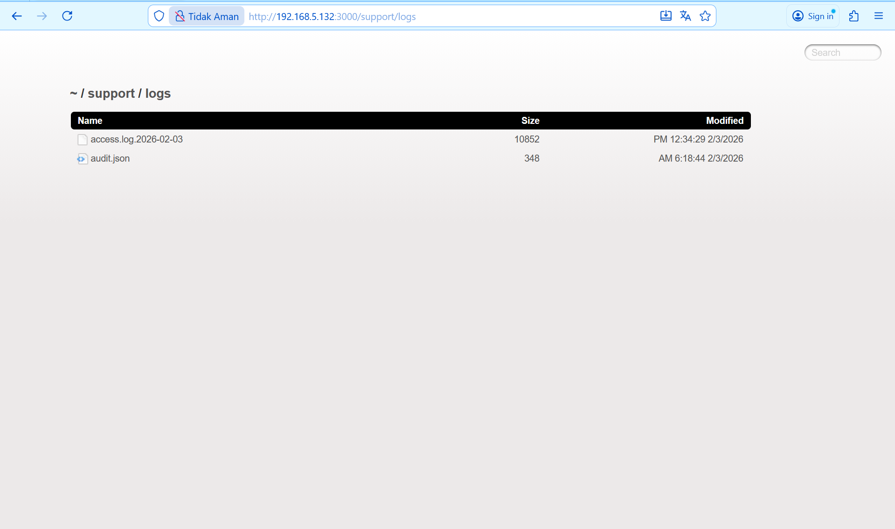

## Challenge 3: Access Log

### Description:
Sang Juru Tulis menyembunyikan buku catatan pengunjung di tempat yang ia anggap aman, namun kini ia lupa label apa yang ia tempelkan padanya. Catatan itu tidak diberi penanda khusus dan mengikuti kebiasaan penamaan yang sudah lama digunakan. Perhatikanlah bagaimana arsip disimpan dan diakses untuk menemukannya.

### Hint:
- File yang dicari kemungkinan adalah log akses pengunjung.
- Nama file tidak unik, tapi mengikuti format standar seperti `access.log.<tanggal>`.
- Lokasi file tidak ditautkan di UI, namun dapat ditemukan jika memahami pola penyimpanan log internal.

### Analysis:
Saat menjelajahi endpoint `http://192.168.5.132:3000/ftp`, saya menemukan beberapa file backup dan internal, antara lain:
- `incident-support.kdbx`
- `coupons_2013.md.bak`
- `package.json.bak`
  


Dari keberadaan file `incident-support.kdbx`, saya menduga sistem memiliki direktori atau akses khusus untuk tim support. Dalam banyak sistem, tim support sering punya direktori sendiri, dan file log biasanya disimpan di subfolder bernama `logs` atau `log`.

Saya mencoba menebak path umum:
[http://192.168.5.132:3000/support/logs](http://192.168.5.132:3000/support/log)

---
### Solution

1. Buka browser dan akses: [http://ip:port/support/logs](http://ip:port/support/logs)


2. Akan muncul dua file:
- `access.log.2026-02-03`
- `audit.json`

3. Klik file `access.log.2026-02-03`


4. File akan menampilkan isi log kunjungan admin:

Contoh log:
```text
GET /rest/admin/application-version
GET /rest/admin/application-configuration
````
5. Setelah file log terbuka, challenge otomatis dianggap selesai.
---
### Flag:

