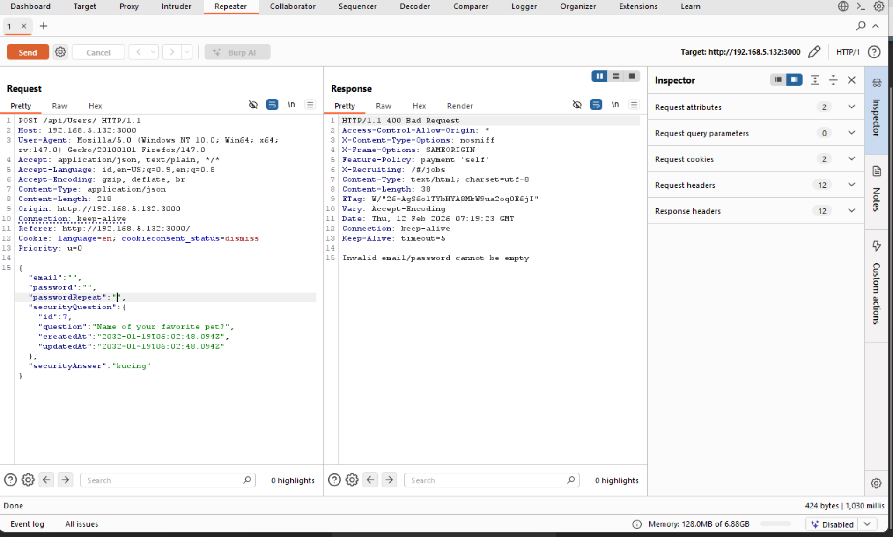
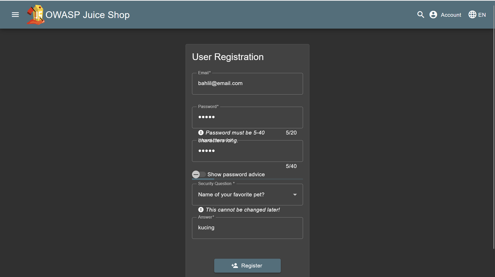
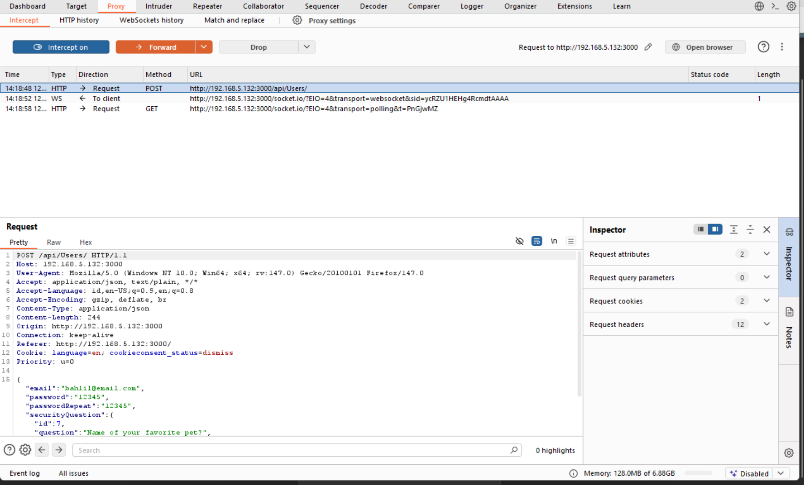
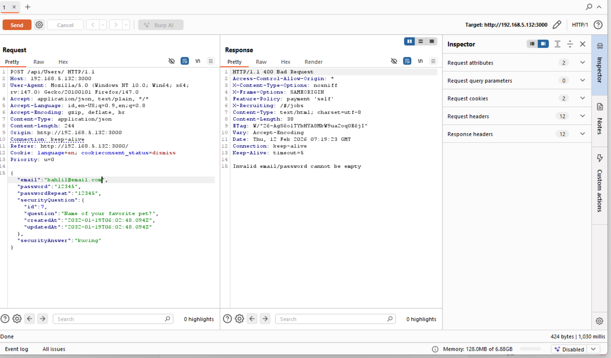
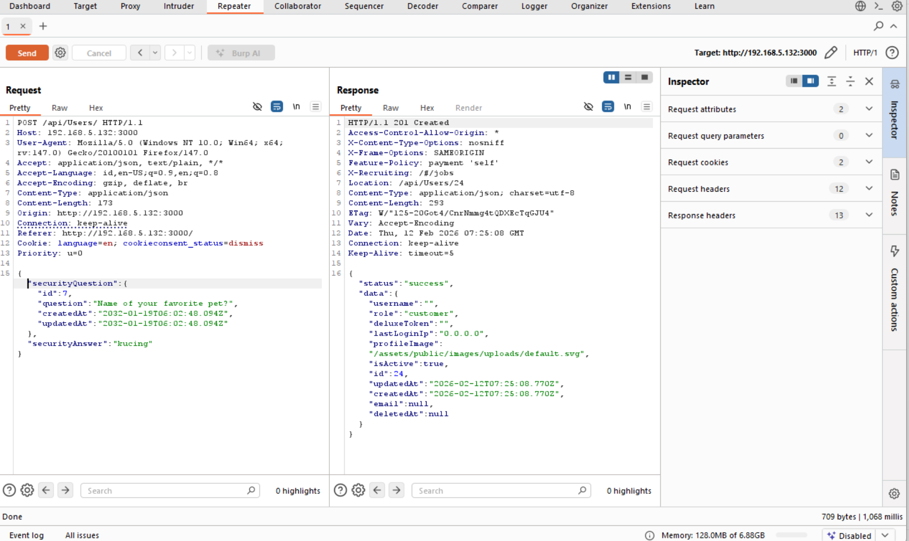
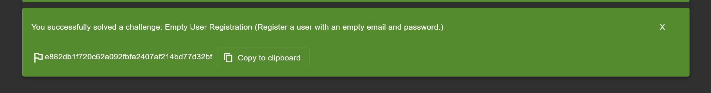

## Challenge 1: Empty Registration

### Description:

Penjaga gerbang mengatakan: 'Kau harus punya nama dan kata sandi.' Namun penjaga gerbang hanyalah pemberi pesan, bukan pembuat keputusan. Raja kasstil mungkin punya peraturan yang berbeda. Temukan cara untuk menyampaikan pesanmu langsung kepada raja, dan lihat apakah ia menerima tamu tanpa nama.

### Hint:

-

### Analysis:

Berdasarkan teka-teki tersebut, "Penjaga Gerbang" merepresentasikan lapisan validasi input (Frontend/API) yang menolak string kosong. "Raja" merepresentasikan logika Database/Backend. Tujuannya adalah mendaftarkan "Tamu Tanpa Nama" (pengguna tanpa email/identitas).

Analisis kami terhadap endpoint `/api/Users/` menemukan adanya ketidaksesuaian antara lapisan validasi dan aturan/constraint pada database:

- **Blokir Penjaga Gerbang:** Mengirim string kosong (`"email": ""`, `"password": ""`) memicu respons `400 Bad Request`, yang berarti validator memeriksa nilai kosong.
- **Celah** Namun, dengan menghapus sepenuhnya key `email` dan `password` dari payload JSON, kita bisa melewati pengecekan validasi tersebut. Database ("Raja") menerima request dan membuat user dengan nilai `NULL`, sehingga secara efektif memungkinkan "tamu tanpa nama" untuk mendaftar.

---

### Solution

1. Buka halaman **Registration** dan coba daftar dengan data dummy.  
   
2. Intersep request `POST` ke `/api/Users/` menggunakan **Burp Suite**.  
   
3. Kirim request tersebut ke **Repeater**.
4. Ubah body JSON dengan menghapus pasangan key-value `email` dan `password` sepenuhnya.  
   
5. Kirim request. _(Server mengembalikan `201 Created`, menandakan user berhasil dibuat dengan `"email": null`)_

---

### Flag:

