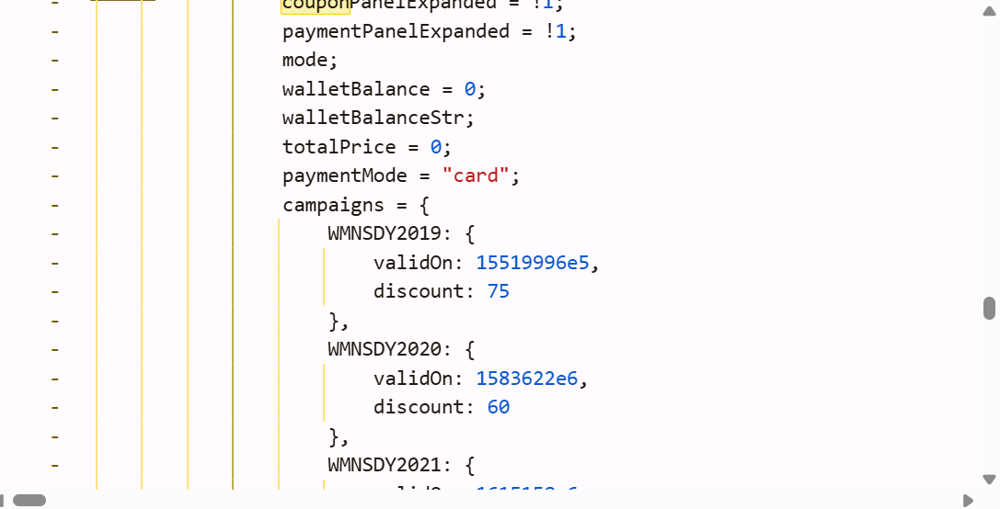
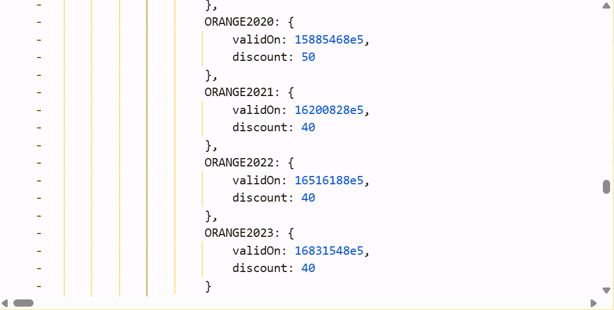
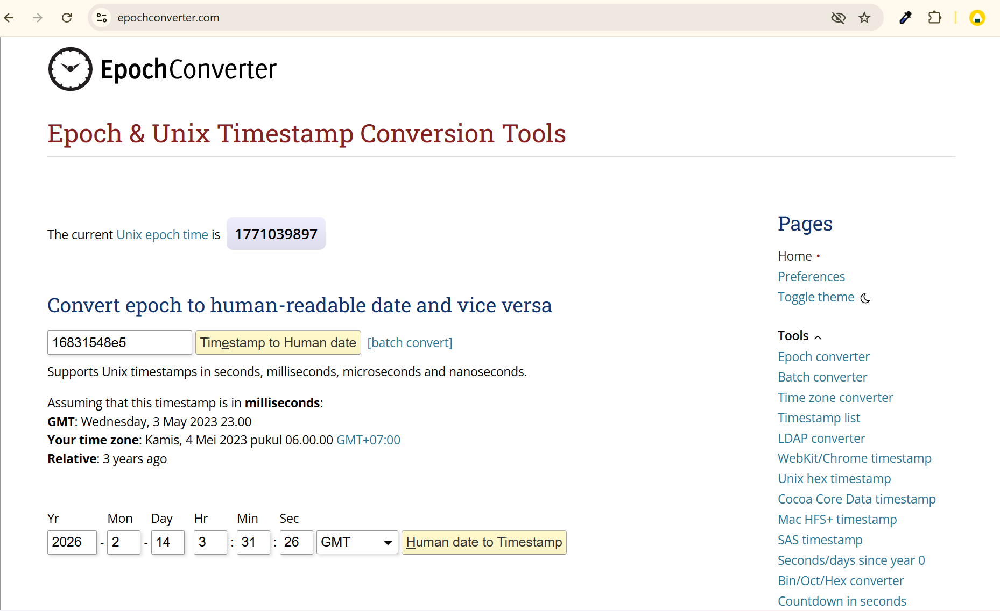
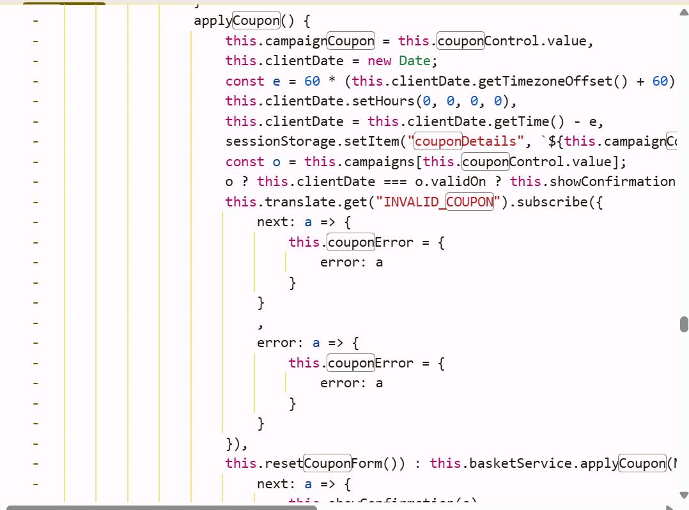
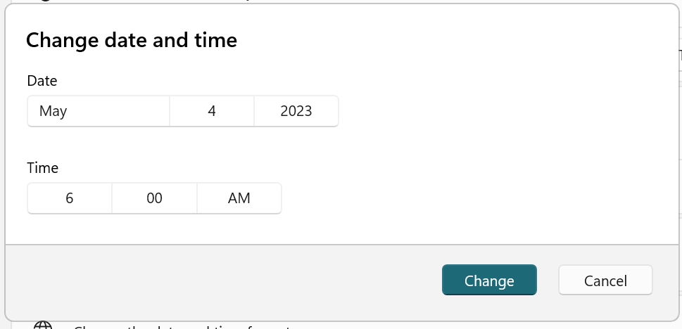
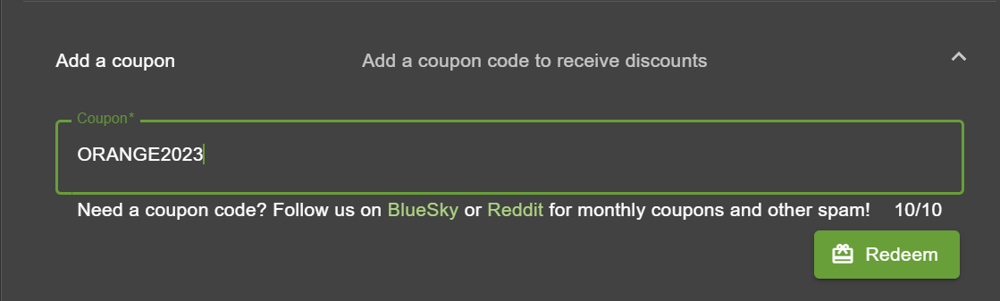
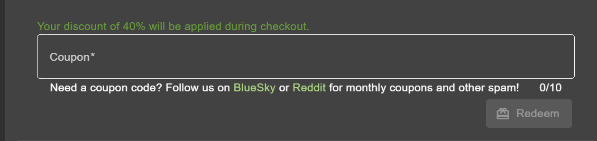
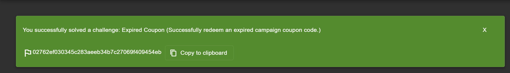

## Challenge 4: Expired Coupon
Category: Improper Input Validation

### Description:

Toko ini membuang diskon lamanya ke tong sampah karena dianggap sudah busuk dimakan waktu. Namun mesin kasirnya tidak punya hidung untuk mencium bau itu. Pungut kembali kode yang telah mati, dan suapkan paksa ke mulut sistem.

---
### Hint:
-

---
### Analysis:

Berdasarkan teka-teki tersebut, “diskon lama” merepresentasikan **coupon campaign** yang sudah tidak dipakai lagi, namun jejaknya masih tertinggal di sisi frontend. “Tong sampah” mengarah ke **file bundle JavaScript** yang masih menyimpan daftar coupon lama. “Mesin kasir tidak punya hidung” menunjukkan validasi yang lemah.

Saat melakukan inspeksi pada `main.js` dan mencari keyword `coupon`, ditemukan object `campaigns` yang berisi banyak kode kupon beserta atribut `validOn` (timestamp) dan `discount`.

Nilai `validOn` berbentuk timestamp (ms sejak epoch). Salah satu nilai `validOn` yang ditemukan kemudian dikonversi ke waktu manusia dan menunjukkan tanggal **4 Mei 2023 (WIB)**, yang berarti kupon tersebut seharusnya sudah expired.

Selanjutnya dianalisis fungsi `applyCoupon()` pada `main.js`. Terlihat bahwa ketika kupon yang dimasukkan **terdaftar di `campaigns`**, aplikasi melakukan validasi secara lokal:

Ringkasnya:

Di main.js, fungsi applyCoupon() mengambil waktu dari perangkat (new Date). Namun sebelum validasi, waktunya dipaksa menjadi awal hari dengan setHours(0,0,0,0), sehingga jam/menit/detik diabaikan. Setelah itu nilainya diubah jadi timestamp dan dibandingkan harus sama persis dengan validOn (clientDate === o.validOn). Karena yang dibandingkan adalah timestamp “awal hari”, maka yang menentukan valid/tidaknya kupon hanya tanggalnya (harinya), bukan jam tertentu.
    

Kesimpulan:

- Validasi kupon campaign ini **client-side** dan bergantung pada **tanggal perangkat**.
    
- Karena itu, kupon lama bisa digunakan kembali dengan **menyetel tanggal laptop** agar sesuai dengan tanggal `validOn`.

---
### Solution:

1. Buka DevTools/Inspect, lalu cari pada file `main.js` dengan keyword `coupon`.  
    
    
2. Temukan object `campaigns`, lalu pilih salah satu coupon code beserta nilai `validOn`.  
    
    
3. Konversi nilai `validOn` ke format waktu manusia (tanggal).  
    Hasilnya menunjukkan tanggal target (contoh: **4 Mei 2023 WIB**).  
    
    
4. Ubah tanggal sistem/laptop ke tanggal tersebut.  
    
    
5. Kembali ke Juice Shop, buka basket/checkout lalu masukkan coupon code tadi.  
    
    
6. Coupon diterima, diskon terpasang, dan challenge **Expired Coupon** berhasil diselesaikan.  
    
    

---
### Flag:

